# Expense Tracker
A Full Stack Expense Tracker built using React, Flask and SQLite.

## Features
* Add Expenses
* Edit Expenses
* Delete Expenses
* Budget Tracker
* Analytics Dashboard
* AI Insights
* AI Finance Assistant
* Light/Dark Theme
* User Profile

  ## Screenshots

### Dashboard (Light Mode)

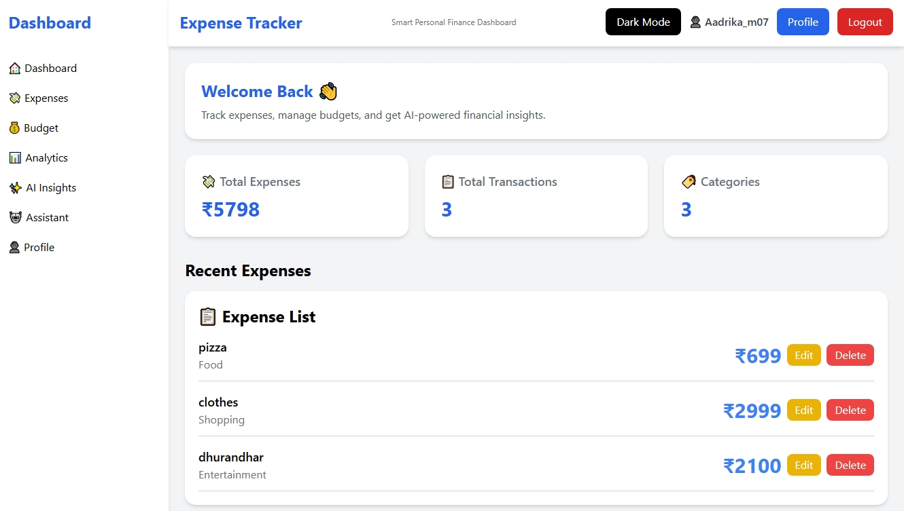

### Dashboard (Dark Mode)

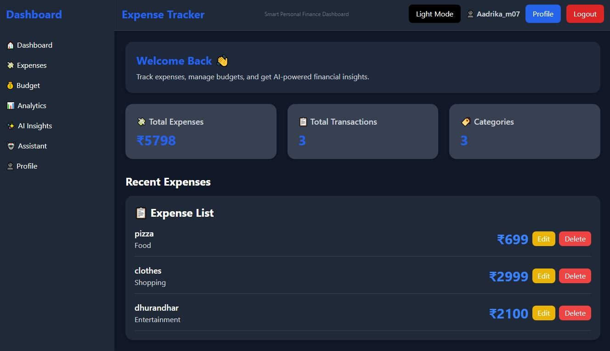

### Expenses (Light Mode)

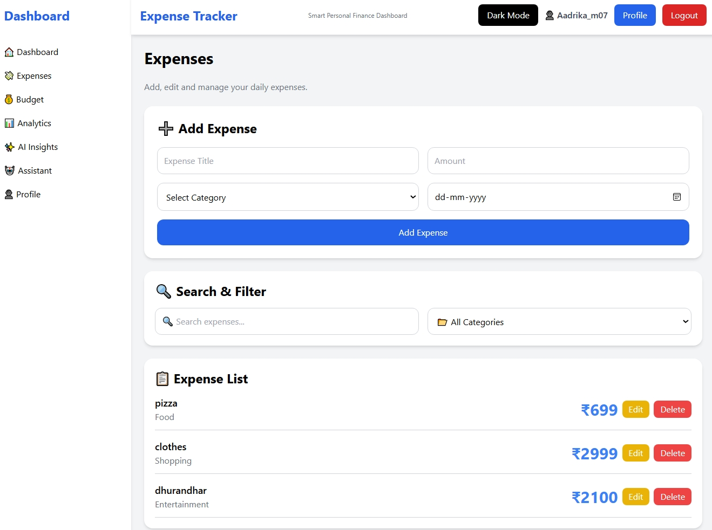

### Expenses (Dark Mode)

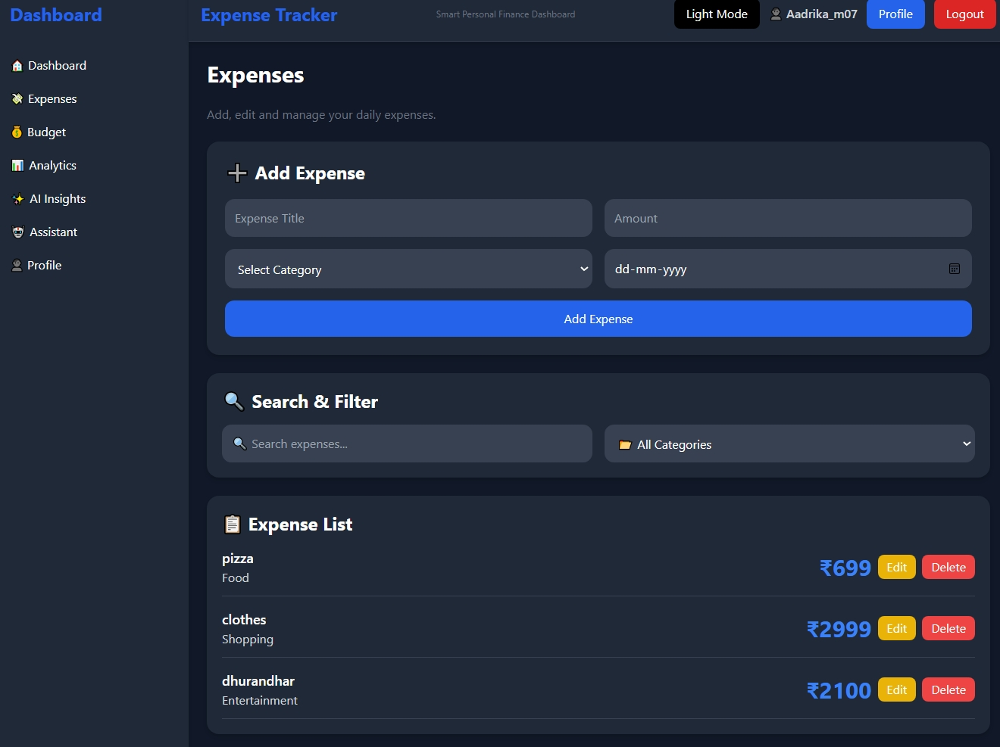

### Budget Tracker

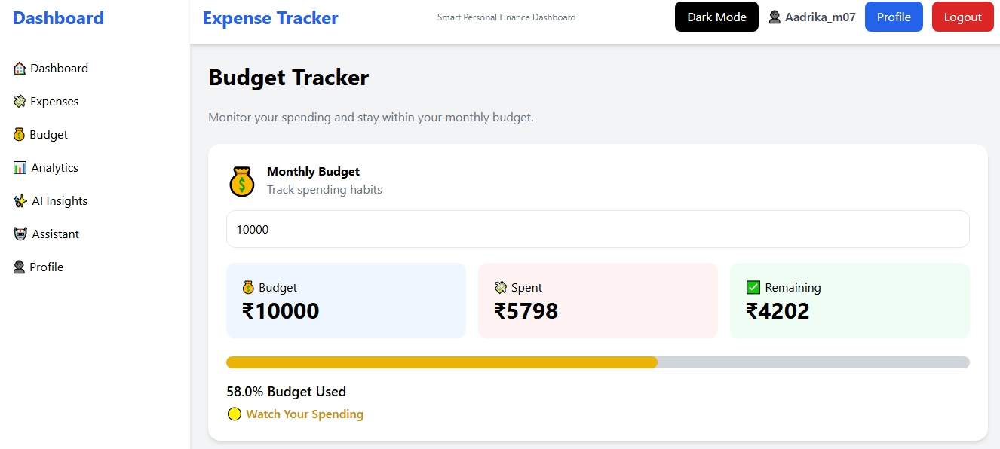

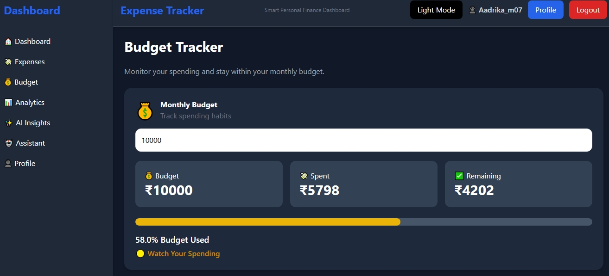

### Analytics

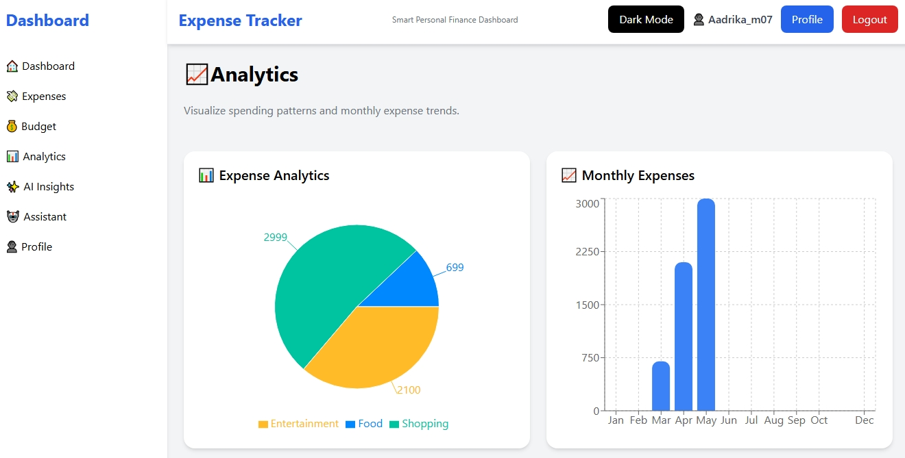

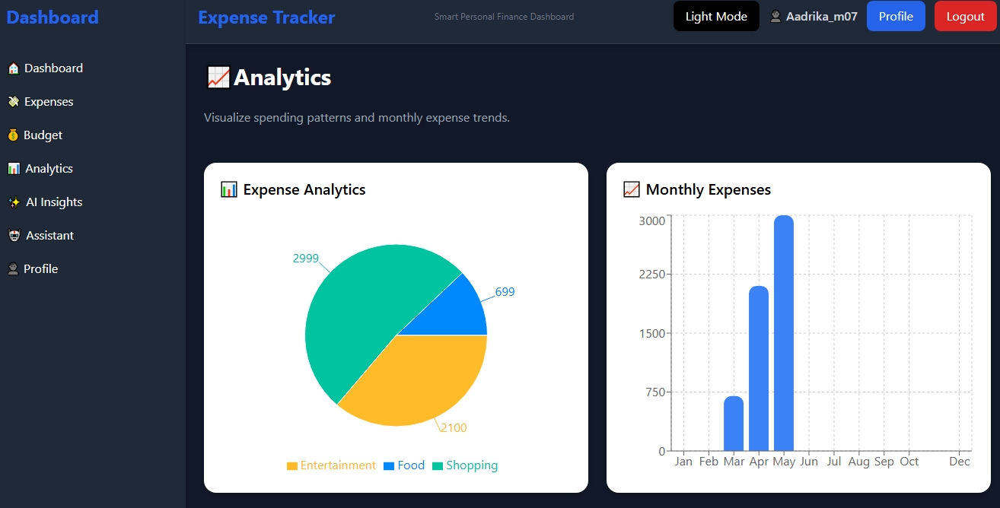

### AI Insights

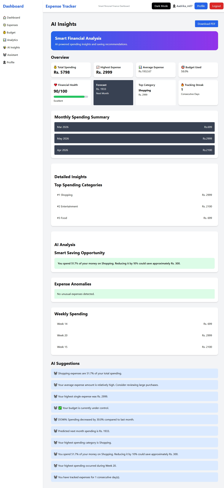

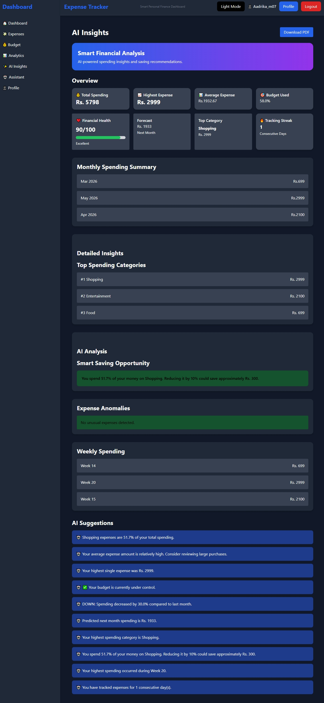

### AI Assistant

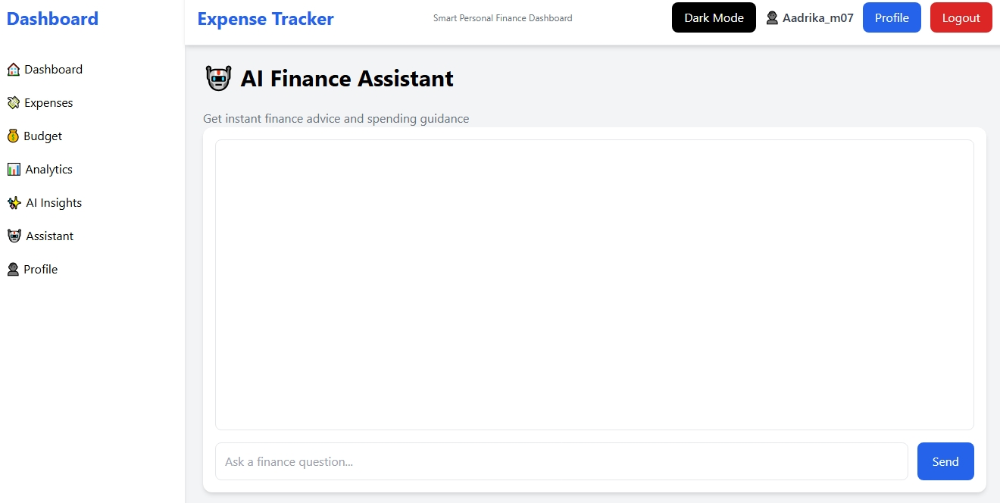

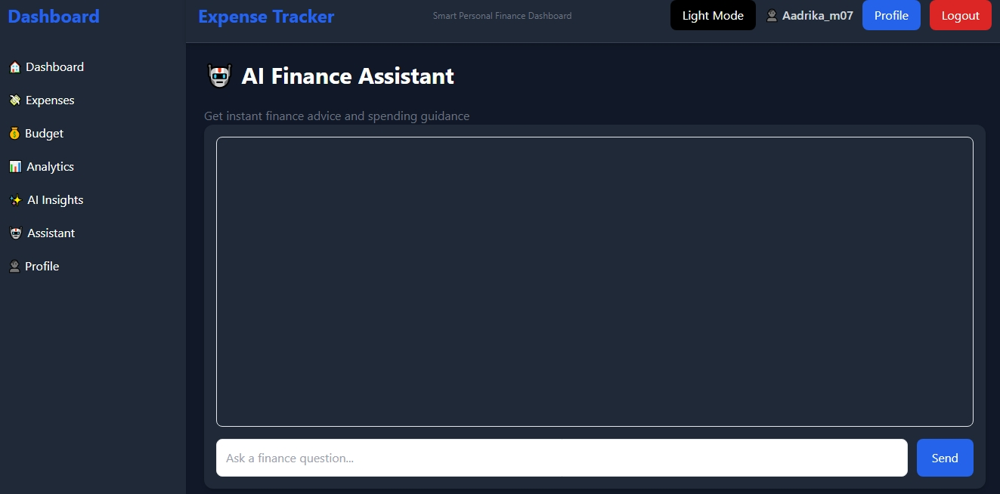

### Profile

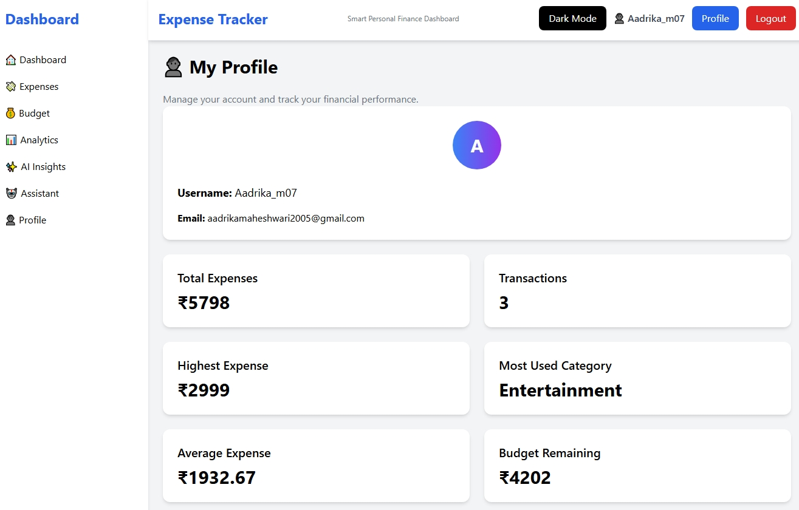

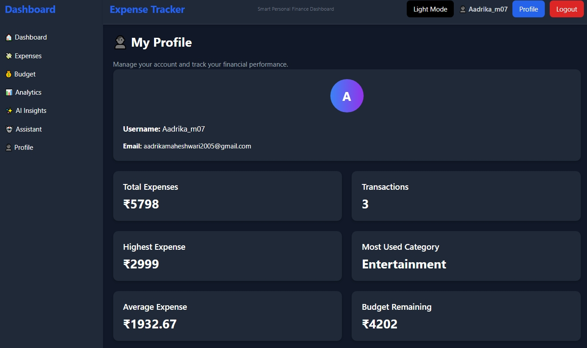

## Tech Stack
Frontend:
* React
* Tailwind CSS
* Axios
* Recharts
  
Backend:
* Flask
* SQLite
* SQLAlchemy

## Installation
Frontend:
npm install
npm run dev

Backend:
pip install -r requirements.txt
python app.py

## Author
Aadrika Maheshwari

git add .
git commit -m "Added README"
git push
